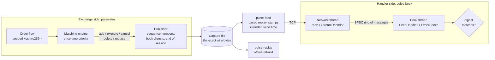

# Pulse

[](https://github.com/Enoch208/pulse/actions/workflows/ci.yml)

Pulse is a market-data engine in C++20. A price-time priority matching engine produces an order-level feed. Pulse encodes it in a compact binary protocol and serves it over TCP or writes it to a capture file. A feed handler on the other end rebuilds every order book from the wire, then proves the rebuild is exact by checking book digests the exchange side publishes inside the feed.

It is small on purpose: about 2,400 lines of library code and one third-party dependency (Catch2, for tests only).

```
$ pulse-sim --messages 1000000 --out session.feed
$ pulse-replay session.feed
replayed session.feed
  messages          1,000,801
  digests verified  800
  throughput        11.65 M msg/s, 451.3 MB/s
  result            every book matched the engine's digests
```

## Results

Measured with `scripts/measure.sh` on a 2 vCPU cloud VM (Intel Xeon @ 2.10 GHz, Linux, GCC 13.3, `-O3`). Every number below comes from one complete run of that script. On a shared VM, results move by 10 to 20% from run to run, so rerun it to measure your own machine.

| What | Result |
|---|---|
| Stream decode (64 KiB reads) | 53.8 M msg/s, 2.1 GB/s, 18.6 ns per message |
| Book apply, 8 instruments, digests included | 12.3 M msg/s, 82 ns per message mean |
| Book apply per event, p50 / p99 | add 91 / 220 ns, execute 73 / 199 ns, delete 87 / 211 ns, replace 133 / 283 ns |
| Full replay of a 1M message capture (decode, rebuild, 800 digest checks) | 11.7 M msg/s, 451 MB/s |
| Order id lookup under churn, 1M live ids | 71 ns/op, against 242 ns/op for `std::unordered_map` |
| Thread handoff, SPSC ring against `std::mutex` + `std::deque` | 6.3 ns/item against 147 ns/item |
| Thread round trip through the ring, p50 / p99 | 467 / 643 ns (mutex: 1,727 / 12,735 ns) |
| Live TCP at 100k msg/s, intended send to book applied, p50 / p90 | 7.3 / 31.6 µs |
| Live TCP unpaced, sustained | 6.0 M msg/s into the books |

Per-event latencies are timed one call at a time and include the 35 ns cost of reading the clock twice.

The live p99 on this VM is about 1.4 ms. It is not a cost inside Pulse. The publisher, the network thread and the book thread are three runnable threads sharing two cores, so at the tail a thread is waiting for the scheduler. The in-process numbers above are what the handler itself costs. Run `scripts/measure.sh` on a machine with spare cores to see the live tail without that contention.

## Architecture



The two halves share nothing except the wire format. The exchange side owns the truth: a matching engine fed by synthetic order flow. Every state change it makes goes out as a feed message, and at a fixed interval it publishes a digest of each book. The handler side rebuilds the books from those messages alone and compares its own digests with the published ones. If one field of one message is wrong, the next digest says so.

Inside the handler, the network thread reads from the socket, reassembles frames and decodes them. The book thread applies them. A lock-free single-producer, single-consumer ring sits between the two, so the book thread never touches a socket and never waits on a lock.

### The order book in memory

```
 bids PriceLadder (sorted, best at the back)
 ┌────────┬────────┬────────┬────────┐
 │  99.96 │  99.97 │  99.98 │  99.99 │◀── best bid: push_back / pop_back
 └────────┴────────┴────────┴───┬────┘
                                │ Handle (uint32)
                                ▼
 Slab<Level>   price · total qty · order count · head · tail      32 bytes
                                │                           │
                                ▼                           ▼
 Slab<Order>   [id·qty·prev·next] ⇄ [id·qty·prev·next] ⇄ [id·qty·prev·next]   24 bytes each
                 first in queue                              last in queue
 OrderIndex    order id ──▶ Handle   (open addressing, linear probing)
```

## Design notes

Why Pulse is built the way it is, including what I tried first and changed.

### Correctness before speed

A feed handler that is fast but occasionally wrong is worse than useless, because someone trades on its book. So before asking how fast it could go, I asked how I would know it was right. That is why the feed carries book digests, why the engine is tested against a deliberately naive reference, and why the decoder and the book are fuzzed. Speed came after, and every speed claim is measured.

### Order level, not price level

A price-level (L2) feed only says "100 lots at 99.99". An order-level (L3) feed names every order, so a handler can rebuild the queue at each price and know exactly who is first. That is the harder problem and the one exchange feeds like ITCH actually pose: executions and cancels arrive by order id, and the handler must find that order in nanoseconds.

### A wire format with no undefined behaviour

Frames are fixed-size little-endian structs behind a 2-byte length and a 1-byte type. Fields are copied with `std::memcpy` into integers instead of casting a buffer to a struct, which avoids alignment and aliasing traps, and big-endian hosts fall back to explicit shifts. I first wrote the codec with shifts everywhere and checked the generated code. Clang merged them into single loads, but GCC 13 kept a byte loop, so I switched to `memcpy`, which both compilers lower to one `mov`. Decode throughput went up 22%. The length is redundant with the type on purpose: if they disagree, the frame is rejected as malformed instead of being trusted and misread.

### Reassembling frames without copying the stream

TCP delivers bytes, not frames, so a read can end anywhere, even inside the length field. The stream decoder decodes complete frames straight out of each read buffer. Only the unfinished tail is copied, into a fixed `max_frame_size` array. When the next read arrives, it takes just the bytes that frame still needs and goes back to decoding in place. No allocation happens on the read path.

### Memory layout of the book

Orders and levels live in slabs: vectors addressed by 32-bit handles, with a LIFO free list. Memory is reserved up front, a freed slot is reused while it is still in cache, and an order is 24 bytes instead of a heap node with 8-byte pointers. Each price level keeps a doubly linked FIFO of its orders through those handles. Appending, removing an order from the middle of the queue and finding the front are all O(1).

Prices on each side are a sorted vector with the best price at the back. Almost all activity happens at the top of the book, so the common cases are a new best price (`push_back`) and the best level emptying (`pop_back`). Anything deeper is a binary search and a short `memmove` of 16-byte entries. I chose this over `std::map` because a red-black tree spends its time chasing pointers through nodes scattered across the heap.

### Finding an order by id

Every execute, cancel, delete and replace names an order by id, so this lookup sits on the hot path. `OrderIndex` is a flat array of 16-byte slots with linear probing and Fibonacci hashing, which spreads the dense, increasing ids an exchange assigns. Deletion shifts later entries back instead of leaving tombstones, so heavy churn never makes probes longer. Under churn with a million live ids it measures 71 ns per operation against 242 ns for `std::unordered_map`, which allocates a node per entry.

### Proving the rebuild is exact

The engine publishes a digest of each book every 10,000 messages. The digest walks both sides best price first and each queue in priority order, so two books digest equal only when they hold the same orders in the same queue positions. Digests are published only between engine steps, because one aggressive order can produce several events and the books are comparable only once all of them are out. A test changes one add order's price by a single tick, and the handler stops at the next digest.

### Testing against a naive reference

The interesting bugs in a matching engine are in priority: the wrong order filled first, or a replace that keeps a place in the queue it should lose. So the engine is checked against a reference that is too simple to be wrong. It scans every resting order to find the best one. 100,000 random requests go to both, and the events, the rejects and the final books must match exactly. The book gets the same treatment against a map of deques, and both comparisons also run under libFuzzer.

### Reproducible order flow

The simulator uses `xoshiro256**` with rejection-sampled bounded draws, not `std::uniform_int_distribution`, whose output differs between libstdc++ and libc++. The same seed writes a byte-identical capture on GCC and Clang, Linux and macOS, and a test pins a fingerprint of the feed so CI proves it.

### Handing messages between threads

The SPSC ring needs one release store to publish an item and one to free a slot, and no lock, so neither thread can be descheduled while holding something the other needs. The producer's and consumer's indices sit on separate 64-byte cache lines, and each side caches the other's index, reading the shared atomic only when the ring looks full or empty. Against a mutex-guarded deque it is 23 times cheaper per item and has a 20 times lower p99 round trip.

### Measuring latency honestly

When the server is paced, each frame is stamped with the time it was meant to leave, not the time it did. If the publisher falls behind, that delay counts against the result instead of disappearing, which avoids coordinated omission. Latencies go into a log-linear histogram (128 sub-buckets per power of two, under 0.8% error, no allocation), because the tail is what matters and a mean hides it.

### Letting measurements pick the optimisations

The first `bench_book` run showed each digest check costing 41.7 µs, a third of total replay time, because FNV-1a folds in one byte per step. Switching to one xxHash64-style round per 64-bit word brought it to 8.4 µs and lifted session throughput from 9.7 to 14.3 M msg/s, measured back to back on the same machine. The commit records both numbers.

## Wire protocol

Every frame is a header followed by a fixed-size body, all little-endian.

| Field | Size |
|---|---|
| length of the rest of the frame | 2 |
| message type | 1 |
| sequence number | 8 |
| timestamp, ns | 8 |

| Type | Message | Body fields | Body bytes |
|---|---|---|---|
| `A` | Add order | instrument u16, order id u64, side (`B`/`S`), price i64 ticks, quantity u32 | 23 |
| `E` | Order executed | instrument, order id, quantity, match id u64 | 22 |
| `X` | Order cancelled (partial) | instrument, order id, quantity | 14 |
| `D` | Order deleted | instrument, order id | 10 |
| `U` | Order replaced (loses priority) | instrument, order id, new order id, price, quantity | 30 |
| `G` | Book digest | instrument, digest u64 | 10 |
| `Z` | End of session | message count u64 | 8 |

As on ITCH-style feeds, the aggressor of a trade never appears unless part of it rests. Executions are reported against the resting order, so a handler can apply them by id alone.

## Correctness

- The matching engine runs against a naive price-time reference across 100,000 random requests, the book against a map of deques across 50,000 operations, and the id index against `std::unordered_map` across 200,000.
- `OrderBook::audit()` checks every link, total, count and ordering invariant, and the tests and fuzzers call it after every step.
- A 50,000 message session is rebuilt through the encoder and decoder in uneven chunks, and every queue is compared with the engine's. Tests confirm that gaps, impossible events, a one-tick price change, wrong end counts and trailing messages are all caught.
- libFuzzer targets with ASan and UBSan cover the stream decoder (chunking invariance and an exact re-encoding round trip) and the order book (against the reference, with an audit after every operation). CI fuzzes each for 60 seconds on every push.
- CI runs the whole suite under ASan with UBSan and under TSan, including a live TCP session through the two-thread client.
- CI builds with warnings as errors on GCC and Clang on Ubuntu and on AppleClang on macOS. The feed fingerprint test proves the output is byte-identical everywhere.

## Build and run

Requires CMake 3.25+ and a C++20 compiler with `std::format`. CI builds with GCC 13, Clang 18 and the AppleClang on GitHub's macOS 15 runners.

```sh
cmake --preset release
cmake --build --preset release
ctest --preset release

build/release/apps/pulse-sim --messages 1000000 --instruments 8 --seed 1 --out session.feed
build/release/apps/pulse-replay session.feed

build/release/apps/pulse-feed session.feed --port 9100 --rate 100000 &
build/release/apps/pulse-book --port 9100

./scripts/measure.sh
```

Other presets: `asan` (ASan with UBSan), `tsan`, `debug` and `fuzz` (Clang, builds the libFuzzer targets in `build/fuzz/fuzz/`).

## Layout

```
src/pulse/wire/      byte codec, message types, frame encode/decode, stream reassembly
src/pulse/book/      slab pool, order id index, price ladder, L3 order book, audit, digest
src/pulse/engine/    price-time priority matching engine
src/pulse/sim/       deterministic RNG and synthetic order flow
src/pulse/feed/      session publisher and feed handler
src/pulse/pipeline/  SPSC ring
src/pulse/net/       TCP sockets
src/pulse/stats/     latency histogram and clock
src/pulse/io/        capture files
apps/                pulse-sim, pulse-replay, pulse-feed, pulse-book
bench/               book, decoder, id index and thread handoff benchmarks
tests/               Catch2 unit, scenario, differential and integration tests
fuzz/                libFuzzer targets
scripts/measure.sh   reproduces every number in this README
```

## Limitations and next steps

- The feed goes over TCP to one client. Real exchange feeds are UDP multicast, where a gap means lost packets and a request to a retransmission server. Pulse detects gaps but treats them as fatal. Gap recovery against a snapshot or replay channel is the natural next step.
- The sockets are plain POSIX sockets with no kernel bypass, busy polling or thread pinning, so the live numbers include the kernel network stack and the scheduler.
- One thread applies every book. Instruments are independent, so books could be sharded across threads by instrument id, one SPSC ring per shard. The protocol already carries the instrument on every message to make that routing cheap.
- The order flow is synthetic: statistically plausible, not a real exchange's. Feeding a real ITCH capture through a translator would test the book against real queue dynamics.

## License

MIT
